# Procesverslag
Markdown is een simpele manier om HTML te schrijven.  
Markdown cheat cheet: [Hulp bij het schrijven van Markdown](https://github.com/adam-p/markdown-here/wiki/Markdown-Cheatsheet).

Nb. De standaardstructuur en de spartaanse opmaak van de README.md zijn helemaal prima. Het gaat om de inhoud van je procesverslag. Besteedt de tijd voor pracht en praal aan je website.

Nb. Door *open* toe te voegen aan een *details* element kun je deze standaard open zetten. Fijn om dat steeds voor de relevante stuk(ken) te doen.

## Jij

  
uitwerken voor kick-off werkgroep

  ### Auteur:
  Wesley Weg

  #### Je startniveau:
  Rood

  #### Je focus:
  Responsive
 

## Je website

  
uitwerken voor kick-off werkgroep

  ### Je opdracht:
  https://www.pokemon.com/nl/

  #### Screenshot(s) van de eerste pagina (small screen): 
  official pokemon homepage
  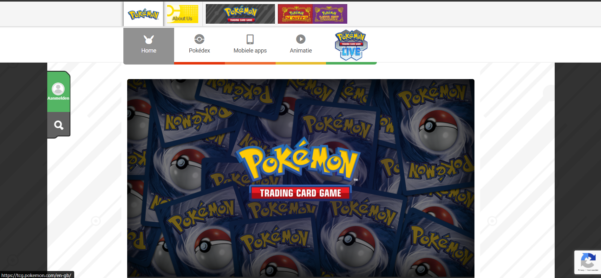

  #### Screenshot(s) van de tweede pagina (small screen):
  Pokedex page 
  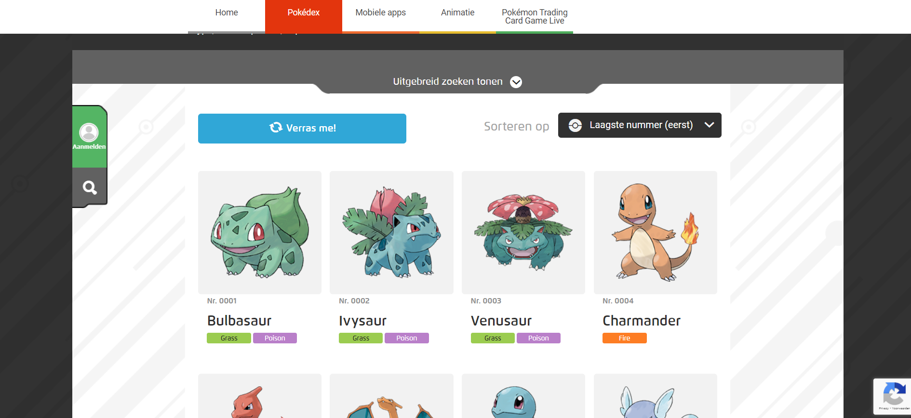
 

## Toegankelijkheidstest 1/2 (week 1)

  
uitwerken na test in 2e werkgroep

  ### Bevindingen
  mijn bevindingen waren in het begin al gelijk er is een navigatie die is double er zijn er 2 en dat is niet zo fijn voor de screenreader daarnaast was de carousel die op de pagina stond niet fijn for the screen reader want het starte vanaf het begin van de carousel en niet het midden wat staat aangegeven op het scherm.
  bij de pokemon info pagina staat een graph die helemaal staat aangegeven met een li dat niet zo fijn is voor een screenreader

## Breakdownschets (week 1)

  
uitwerken na afloop 3e werkgroep

  ### de hele pagina: 
  

  ### dynamisch deel (bijv menu): 
  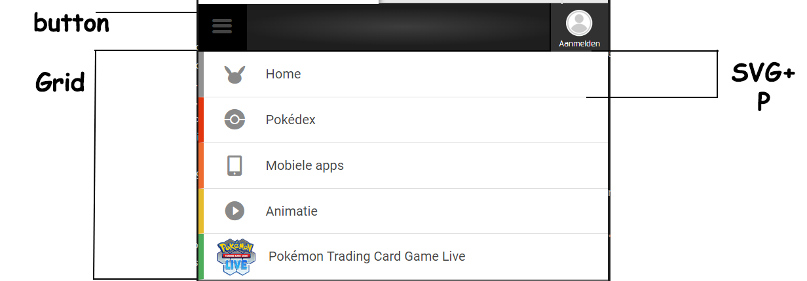

  ### wellicht nog een dynamisch deel (bijv filter): 
  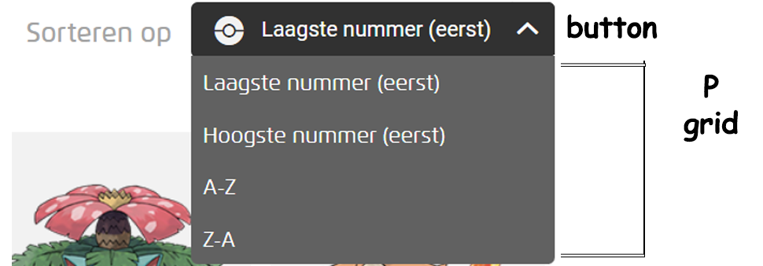

## Voortgang 1 (week 2)

  
uitwerken voor 1e voortgang

  ### Stand van zaken
  voor de navigatie ging in het begin wel goed maar naarmate dat ik begon met svg was het even kijken hoe dat in elkaar zat toen na het vragen aan een studenten assistent kwam ik achter dat het gewoon in de html gezet kan worden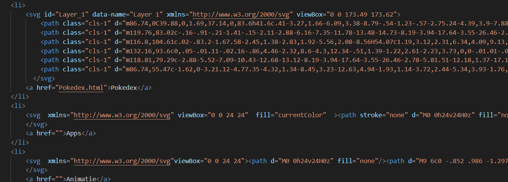
  daarnaast ging de navigatie wel

  ### Verslag van meeting
  hier na afloop snel de uitkomsten van de meeting vastleggen

  - Achtergrond image via css
  je kon in de css een background:url("image"); gebruiken voor een background image dat mee scaled

  - beste manier om de nav te creeëren
  bij de nav kan je het beste een grid maken en als je de hover wilt doen moet je per item selecteren 

## Voortgang 2 (week 3)

  
uitwerken voor 2e voortgang

  ### Stand van zaken
 hier zat ik heel erg te proberen mijn eerste grid responsive te maken dat ik uiteindelijk heb veranderd naar flex ook al bleek dat niet het probleem te zijn maar was het dat de img 1 groote was dat niet mee wilde verkleinen

  ### Verslag van meeting
  hier na afloop snel de uitkomsten van de meeting vastleggen

  - beter en sneller om in de mobiele versie te beginnen en dan responsive maken voor desktop
  - zet de h1 , h2 en h3 in een betere volgorde
- ...

## Toegankelijkheidstest 2/2 (week 4)

  
uitwerken na test in 9e werkgroep

  ### Bevindingen
  de screenreader skipt door letters heen(engels naar nederlands is waarschijnlijk het probleem)
  nav svg geeft bij elke navigatie een img aan
  de screenreader geeft aan dat het nederlands is maar spreekt het engels uit
  verander de pokemon text het klopt niet met de context

## Voortgang 3 (week 4)

  
uitwerken voor 3e voortgang

  ### Stand van zaken
  het maken van mobiel formaat ging best goed geen last van gehad en kwam er goed uit ook al is er aangegeven dat van desktop naar mobiel doen vrij 
   lang en lastig is. 

  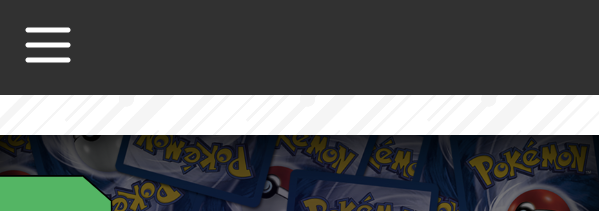
  de plek waar ik veel moeite mee had was de zoekbalk op de pokedex pagina om die samen met de svg ernaast responsive te krijgen uiteindelijk was 
   het dat de width een vol gezet aantal was en niet scalable samen met dat de text hetzelfde probleem had waardoor alles uit het scherm of alleen  
    dat stukje over het volle scherm gaat.
    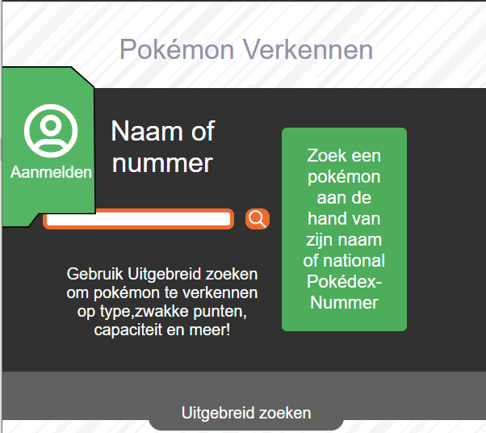

  ### Verslag van meeting
  hier na afloop snel de uitkomsten van de meeting vastleggen

  - voor de hamburger menu gebruik display: none; anders leest de screenreader er over heen

## Eindgesprek (week 5)

  
uitwerken voor eindgesprek

  ### Je uitkomst - karakteristiek screenshots:
  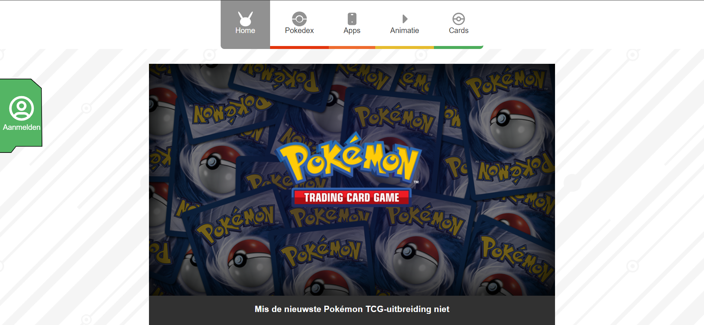
  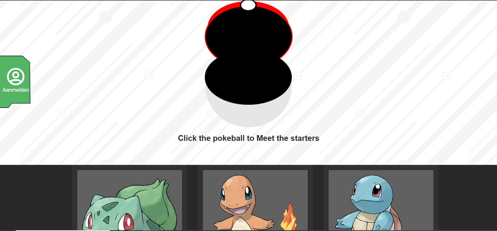
  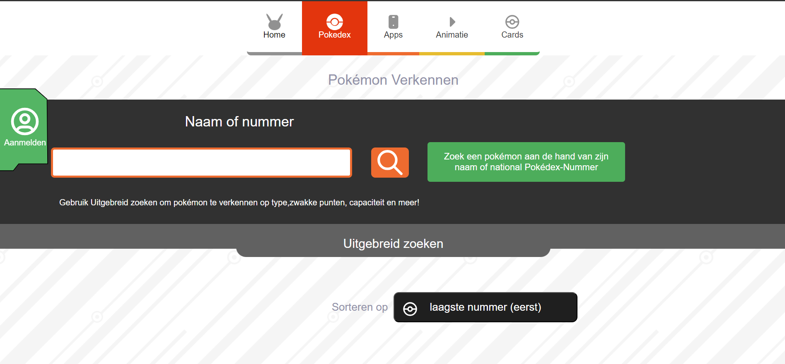
  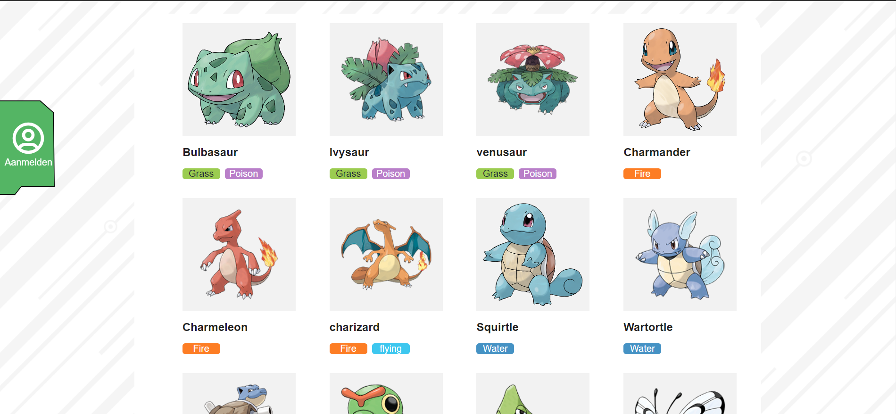

  ### Dit ging goed/Heb ik geleerd: 
  het ging goed met het maken van de grid voor de pokedex pagina daar heb ik ook veel van geleerd ik heb nooit eerder grid gebruikt dus dat was    
  cool om te leren.
  ook het maken van de navigatie van desktop naar telefoon ging goed

  
  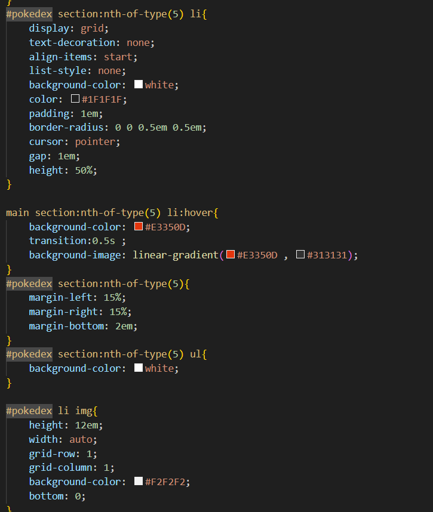

  ### Dit was lastig/Is niet gelukt:
  het maken van de pokeball clickable voor de focus state wilde niet werken.
  ook het maken van de focus state op de pokedex pokemon lijst ik had het geprobeerd met een tabindex maar helaas werd dat als 1ste order gedaan 
   heb daarna geen tijd meer gehad om bijde paginas helemaal te orderen voor de focus state.
  Ook wilde ik nog het aanmelden kunnen laten uitschuiven en dat je van daar kan inloggen maar daar heb ik geen tijd voor gehad.

  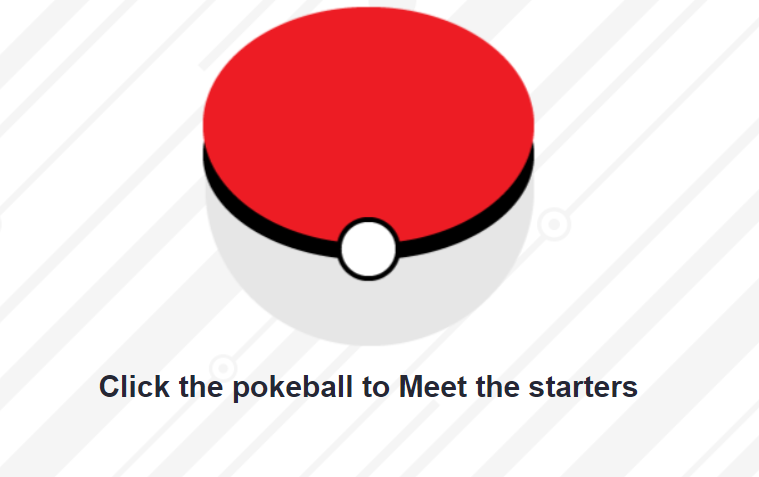
  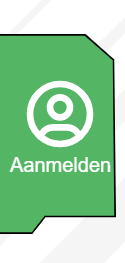

## Bronnenlijst

  
continu bijhouden terwijl je werkt

  Nb. Wees specifiek ('css-tricks' als bron is bijv. niet specifiek genoeg). 
  Nb. ChatGpT en andere AI horen er ook bij.
  Nb. Vermeld de bronnen ook in je code.

  1. [bron 1](https://quentin-bellanger.com/blog/keyboard-navigation/)  (tabindex)
  2. [bron 2](https://a11y-guidelines.orange.com/en/articles/accessible-hiding/#:~:text=The%20conventional%20way%20is%20to,by%20Assistive%20technologies%20(AT).)  (aria-hidden)
  3. [bron 3](https://developer.mozilla.org/en-US/docs/Web/CSS/:focus-visible)  (focus state)
  4. [bron 4](https://github.com/Wesley-weg/Taffeltennisgame) (eigen project (meeste voor javascript))
  5. [bron 5](https://codepen.io/)  (alle klasikale lessen)
  6. [bron 6](https://www.w3schools.com/CSS/css_grid.asp) (grid layouts)
  7. [bron 7](https://tabler.io/icons)  (icons)

